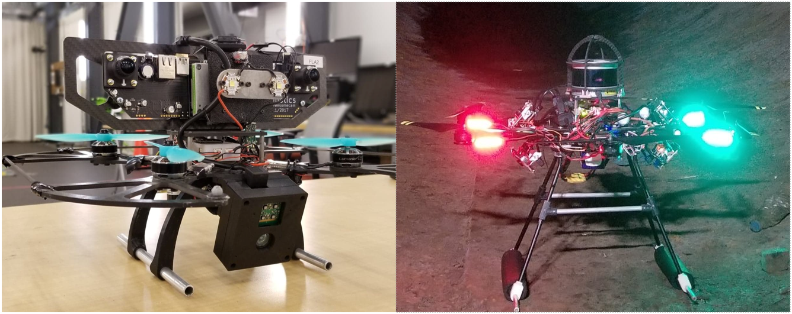
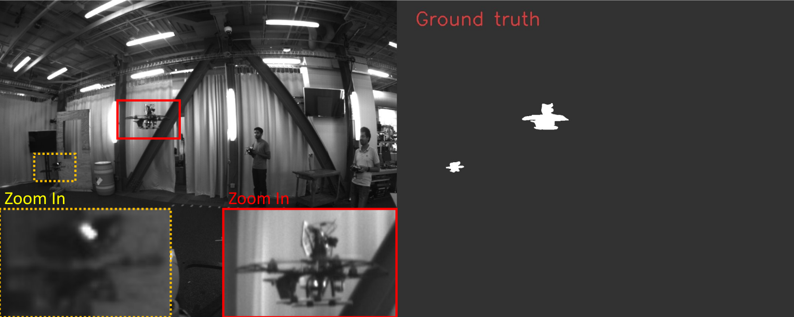

<p align="center">
 <b> MAVNet: an Effective Semantic Segmentation Micro-Network for MAV-based Tasks</b> 
</p>
<p align="center">
 <i> Ty Nguyen, Shreyas S. Shivakumar, Ian D. Miller, James Keller, Elijah S. Lee1, Alex Zhou, Tolga ̈Ozaslan<br> Giuseppe Loianno, Joseph H. Harwood, Jennifer Wozencraft, Camillo J. Taylor, Vijay Kumar <i>
</p>

<p align="center"> 

 </p>
<p align="center"> 
   <i>MAV used to collect data and test network models</i> 
</p>

##### Source: https://arxiv.org/submit/2714868/view
##### Cite: 
```
@article{nguyen2019mavnet,
  title={MAVNet: an Effective Semantic Segmentation Micro-Network for MAV-based Tasks},
  author={Nguyen, Ty and Ozaslan, Tolga and Miller, Ian D and Keller, James and Shivakumar, Shreyas and Loianno, Giuseppe and Taylor, Camillo J and Kumar, Vijay and Harwood, Joseph H and Wozencraft, Jennifer},
  journal={arXiv preprint arXiv:1904.01795},
  year={2019}
}
```

# Datasets
### MAV Segmentation Dataset
<p align="center"> 

 </p>
<p align="center"> 
   <i>A sample image from the drone dataset<br>
    From left to right: input image,  labeled image. White: drone, gray: background</i> 
</p>

### Penstock Dataset
<p align="center"> 

 </p>
<p align="center"> 
   <i>A sample image from the penstock dataset.<br>
    Pink: corrosion, light blue: background, dark blue: rivet, green: water, gray: ignore</i> 
</p>

___
# Instructions 

___
# 1. Before start
## Copy the whole repository to your desirable place 
```
git clone https://github.com/tynguyen/MAVNet.git ~/github_MAVNet/MAVNet
```
There are two ways to run the code: docker and host machine. 
If choosing to run on docker (easier), go to step 1.1, if choosing to run on host machine (your local machine), go directly to step 1.2. 
## 1.1 Prepare to Run on docker 
### Install nvidia-docker if you've not had it 
Check
```
sudo nvidia-docker
```
if there is error, it means that you need to install it

Link: 
https://github.com/nvidia/nvidia-docker/wiki/Installation-(version-2.0)


### 1.1.1 Pull the docker
```
cd MAVNet/docker/docker_scripts/build_ubuntu16_cuda9
bash pull_docker_image.sh  
```

### 1.1.2 Create docker container 
```
cd MAVNet/docker/docker_scripts/build_ubuntu16_cuda9
bash create_container.sh  
```
### 1.1.3 By default, code folder is shared between host machine & the docker. In docker, it appears as 
```
/root/MAVNet/ 
```
Change this by editing file create_container.sh and do step 1.1.2 again. 

## 1.2 Prepare to Run on host machine  
### 1.2.1 Change environment variables of location to the code, data, log, results ...
Skip this step if doing step #1 without changing anything.  
```
cd code/scripts 
vi set_dir.sh
``` 
Set HOMEDIR as <your_repo>/MAVNet

Set LOGDIR as <your_desirable_repo>

Set DATALOADER  as <your_data>. For example, data is stored at HOMEDIR/data/.
There are multiple datasets that can be used to train and evaluate. By default, it use perch_drone dataset.
Corresponding to this dataset is the dataloader with the same name in HOMEDIR/code/dataloaders/. 


---
# 2. Test
The following test procedure is for penstock dataset. We use DATALOADER="perch_drone" in code/scripts/set_dir.sh

To test on other datasets, change perch_drone accordingly to your DATALOADER. 
  
## 2.1 Set environment variables of location to the code, data, log, results ...
(On every new terminal) Run set_dir.sh to set the variables regarding repositories to the code, meta data (log, results, models)   
```
cd code/scripts 
bash set_dir.sh  
```
* Note: if testing a dataset other than perch_drone, run
```
bash set_dir.sh <dataset_name> 
```

* Note: by default, image size is 1024 x 1280. If testing image with different size, run  
```
bash set_dir.sh <dataset_name> <image_size> 
```
for example:
```
bash set_dir.sh perch_drone 512x640 
```


## 2.2 Choose model type
By default, the test script will use MAVNet.

## 2.3 Run the test script
These scripts will run the inference & generate prediction images based on the latest pretrained model.  
 
```
cd code
bash scripts/run_gen_segmentation_images_on_gt.sh  
```
Image results are saved at LOGDIR/meta_data/results/perch_drone/<net_type>_<net_version>_<loss_type>/


#  2.4 Benchmark 
* Use batch_size of 4 during training.
* Testing uses batch size = 1
* For each model, do inference on every checkpoint
* For each checkpoint, do inference 30 times on the whole test set to get average result. 
Run by default 
```
cd code
bash scripts/run_test_on_gt.sh 
```

To choose other models
```
cd code
bash scripts/run_test_on_gt.sh <name_of_other_models>  
```

## Results 
They are stored at HOMEDIR/final_reports/<net_type>_<net_version>_<loss_type>_results.csv


---
# 3. Dataset
## Penstock dataset
* Train & Test datasets are taken from two sequences. Look at HOMEDIR/code/penstock_dataPreparation/gen_files_list.py 
for more details about which camera images are used for train/test.  
* Input segmentation image has 1 channel 
* Input image is RGB  
* Run 
```
cd HOMEDIR/code/penstock_dataPreparation 
python gen_files_list.py 
``` 
to generate train.csv and test.csv files. This needs to run only one time, even after copying the whole 
HOMEDIR/code to a new place.  

## Perch drone dataset
* Use drone_preparation code 
* Input segmentation image has 3 channels 
* Input image is gray => don't use color change (but still 3 channels) 
* Run 
```
cd HOMEDIR/code/drone_dataPreparation 
python gen_files_list.py 
``` 
* This function will modify the segmentation images to make it 1 channel with indices indicating objects, according to label_perch_drone_list in HOMEDIR/code/configurations.py 
 
 
---
# 4. Train 
## 4.1 Set environment variables of location to the code, data, log, results ...
(On every new terminal) Run set_dir.sh to set the variables regarding repositories to the code, meta data (log, results, models)   
```
cd code/scripts 
bash set_dir.sh 
```

## 4.2 Choose model type
By default, the test script will use MAVNet v1.

## 4.3 Choose network version 
By default, verion = '' 
Look at /code/networks/.... for available networks & versions 

## 4.4 Choose loss type 

## 4.3 Run the train script 
For example, train MAVNet version v1, focal loss: 
```
cd code
bash scripts/run_train.sh MAVNet v1 focal 
```

* Models would be stored at HOMEDIR/models/<net_type>_<net_version>_<loss_type>.
* Saved test & train image segmentation would be stored at LOGDIR/meta_data/results/<net_type>_<net_version>_<loss_type>
* Log (for tensorboard visualization) would be stored at LOGDIR/meta_data/logs/<net_type>_<net_version>_<loss_type>/train & test

###### 

